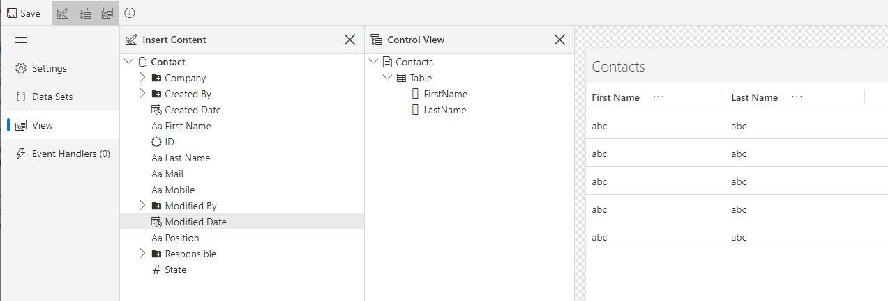
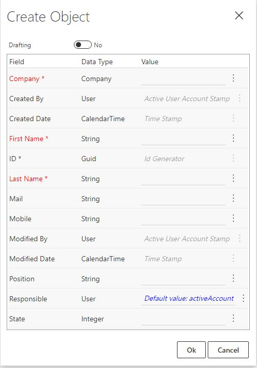

## Exercise 3.2 - Forms

You will now add a list to the Company-form that shows all associated Contacts. You will also make actions to create new Contacts and open existing ones.

### 3.2.1 Create the Contact View

1. Navigate to Pages in the Company module. Add a New Page -> View.
2. Name the View "Contacts" and choose Master Data Source = Contact.
3. Navigate to View and drag relevant data fields into the View. Each column and cell can be formatted and styled by marking it and adjusting settings on the right hand side. Settings can be e.g. Column label, content alignment, filter enabling and text formatting.
4. Toggle "Show Control View Pane" in the Ribbon (or click Ctrl+Shift+L). Both here, and directly in the view editor, you can alter the column arrangement by drag and dropping columns.

  

### 3.2.2 Add the Contact View to Company
4. Navigate to the "Company"-form -> Form.
In the lower section, mark the Tab Control with Logs. Click on Pages in the right hand Tab Control edit.
Add a Page and set target to your View named "Contacts", and set an appropriate name and title. The title is shown in the Tab name.
5. Click the data filter and the menu for the Contact data source. Choose "Read Related".
6. We want to read Contacts for the single Company contained in the Company Form. Select to filter objects on the Company source data set. Because one Company may have several Contacts, it is a One to Many Relationship (One Company and many Contacts). Make the filter read Contacts related to the Company by defining the connection between them in the "outbound field in target" section. This defines the relationship required between the Company from the Form and the Contact list.

7. Save and refresh the app in your browser. Navigate to a Company. We can now see the Contact Tab, at the bottom of the Company page. As the database table is empty, no Companies has any contacts yet.

8. Now that we can view the table with relevant contacts, we want to be able to view more details about a single contact or even create a new one.

  

### 3.2.3 Create Action for New Contact

In order to create a new Contact, we need to create a Client Action which creates a new Object and allows for user input. This action will be available within this module.

1. Navigate to Client Actions and add new, name it "Add new contact".
2. Go to Action Flow. Navigate to "Effects" on the left hand side. Add a Scope Block by double clicking or dragging it into the working area.
Now we want to Create a new Contact which will be edited in the "Contact Details" Form we created initially. The Form is a type of Page, and we add a "Navigate to Page"-effect into the scope. Select Contact Details as the Page.
3. In the Data Filter-section, click the menu and select "Create Object". Some values here are preset, and some must be given as input. Some can be left blank for the user to fill in and some, like State, should have default values (State = active) which can be edited by the user later. Note that Company is mandatory and blank. As we plan on trigging this Action from the Company form, we will know which Company we want to fill inn here and should send it in as input to the action.

  

4. Navigate to Data Sets and add a Data Source for Company in the Public Interface section. Keep Flow set to In, since we want to receive this information *from* the Company Form. The Company Data Source does not have to be Required. We may want to trigger this action other places within the Company Module where the Company is not pre-defined from context. In these cases, Company value can be set within the "Company Details" Form, along with values such as first name and last name.

5. Return to Action Flow. Re-open the "Create Object" data filter. In the menu for the Company field, choose Select Field and choose the Company data source you just added.

6. Save and close.

  Create Object           |  Data Source selection
  :-------------------------:|:-------------------------:
    | 

<!-- 

  
  

 -->

### 3.2.4 Utilize Action to Create New Contact

6. Re-open the Contacts View. Navigate to View, open the Control View (Ctrl+Shift+L) and mark the top level - Contacts.
7. In the Page-section on the right hand side. Click "Action Bar". Here, you can see built-in actions, as well as the Client Actions defined in the Module. Select "Add New Contact", set the label to "New" and an appropriate Icon (e.g. Basic-Contacts" or "Basic-AddButton". In the Data Exchange, we can see the Company data source defined in the Action. In order to send data into the Client Action, we need to define a corresponding data source in the View.
8. Close the Action Bar Editor and navigate to Data Sources. Add a Public Interface Data Source for Company. As in the View, the Data Source should be single occurrence and not Required.
9. Return to the Action Bar editor. Mark the "New"-action and click the Data Filter. Set the newly defined Company Data Source as input. While we're here, add another action to the action bar. From the built-in actions, select "Save changes". Rename to "Save" and set the icon "Save-fluent". Save and exit.

  

10. Refresh the app in your browser. Navigate to a Company, click the Contacts-tab and Add New. As you can see, the Company field is already filled in. Add First and Last name, and optionally email or mobile.

11. When you return to the Company page, we see the new Contact in the Contact Tab. However, nothing happens when we click the row. We need to add functionality for showing Contact information when a row is activated/clicked.

### 3.2.5 Open Contact Information
12. Return to the Client Actions-section and create a new one named "Navigate to Contact". In Action Flow, add the "Navigate to Page"-effect. Now we need a data source to filter into the Page.

13. Navigate to Data Sets and add Contact as a Public Interface Data Source. Set Occurrense to One and Required as Yes. If we do not have a Contact to show, we do not want to navigate to the Contact page.

14. Add the Contact Data Source to the Data filter for the "Navigate to Page"-effect by transferring all.

15. Return to the Contacts view. Mark the Table-level in the Control view (optionally: mark a column and press esc).

16. On the right hand side Navigate to the "On Activate"-dropdown. Select the Client Action you just created "Navigate to Contact"

17. Set the data exchange to Contact (0:n) from the view. The view will read the correct Contact/Row from context.

18. Save and refresh your browser.
19. Navigate to your newly created Contact via Company.

<table>
   <tr><td><a href="exercise-03-1.md"><- Previous</a></td><td align="right"><a href="exercise-04.md">Next -></a></td></tr>
</table>
