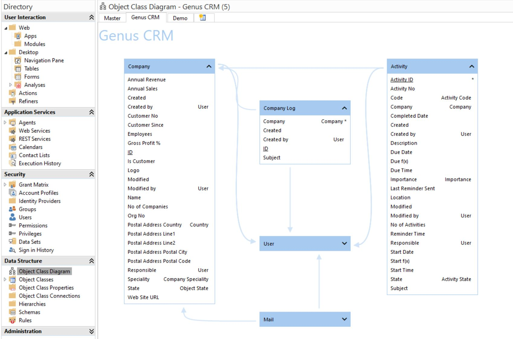

# Studio

# Introduction to modeling
In the first part of the exercises, you will be modeling new object classes.

A Genus application delivered to a customer will typically support a customer's business model either fully or partially. For instance, one can cover big parts of an employment agency's business model with an application supporting case management, reporting, document archiving, communication (mail/SMS) and integration towards external systems. Whilse some customers have their main focus on reporting, others are for example more interested in searching business data.

Common to all business models - whether this is "full-scaled" case management solutions, Business Intelligence solutions (corporate governance with reports and analysis in focus) or technical integration solutions - they all have an object model.
An object model is basically the customer's business objects interconnected. The object model often corresponds to the data model that we see in the database, but it is built ("reflected") in Genus Apps and can have additional logical connections, information and even object classes. The advantage of making the object model in Genus Apps is that Genus Apps will maintain conenctions, dependencies, primary keys, data consistency, data types and creation, modification and deletion of data. Deletion rules, duplication rules, validations rules, automated rules (equivalent to "triggers" in the database world) - all of it is controlled by Genus Apps.

The object model is exposed to the end user through Views and "Forms", combined with actions, search functionality, etc. The developer sets up the object model, the logic of the actions, search properties and GUI using Genus Studio.

In Genus Studio, we refer to an object (e.g. "Company") as an "Object Class". A property of an Object Class like Company (e.g. "Name" or "Org No") is called "Object Class Property" or "Property".
The provided Genus CRM solution has a simple object model described in the Case Description chapter. What's missing in your solution are Contact Log, Document and Request. In the first part of the exercises, you will be asked to expand the object model with Contact and Contact Log.

*The initial version of the Genus CRM object model. In Studio, choose "Object Class Diagram" (left menu) to open the diagram. Here you will see 5 Object Classes with several Object Class Properties.
NOTE: A diagram is just a drawing board where you can visualize a selection of objects (all objects that exist in the solution are listed under "Object Classes" in Studio). In the diagram, you will automatically see relations between objects. If you delete an object from the diagram, it will only disappear from the diagram view - the objects will not be removed from the solution.*
